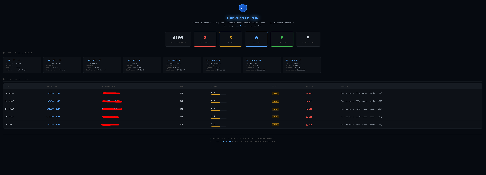

# DarkGhost NDR

Network Detection & Response — Anomaly-based Behavioral Analysis + SQL Injection Detector

Built by Ilie Lucian — April 2026

---

## Screenshot

---

## What it does

I built this to monitor my own 2 nnetworks (see my repositories to understand on what networks I am testing it).
It learns how each device normally behaves and raises alerts when something changes.

It does not use signatures. It looks for weird things in the network.

---

## What it detects

| Detection | Example |
|-----------|---------|
| New protocol | Device starts using ICMP for first time |
| Sensitive port | SSH, RDP, Metasploit (4444) |
| New destination | Device talks to unknown IP |
| Night traffic | Activity between 00:00 and 06:00 |
| Large packets | Possible data exfiltration |
| Port scan | Many ports in short time |
| Spoofing | TTL changes (Windows to Linux) |

---

## How scoring works

Each anomaly adds points. Final score is weighted:

final = (highest x 0.6) + (average x 0.4)

Score ranges from 0.1 (normal) to 0.95 (critical).

Risk levels: CRITICAL (0.8+), HIGH (0.6+), MEDIUM (0.4+), LOW (0.2+)

---

## Live dashboard

Web interface shows:
- Total packets and alerts
- Devices with detected OS
- Live alert log with score and reason
- Auto-refresh every 5 seconds

---

## Architecture

Traffic (SPAN port) -> Scapy capture -> Baseline -> Anomaly score -> Alert -> Flask dashboard

No database needed. Baseline saved to baseline.json.

---

## Technologies

- Python 3 (Scapy, Flask, requests)
- HTML/CSS/JS (dashboard)
- JSON for storage

---

## Repository content

DarkGhost-NDR/
├── README.md
├── screenshot.png
└── docs/
    ├── architecture.md
    ├── deployment.md
    └── anomaly_scoring.md

Note: Documentation only. Source code is proprietary.

---

## Deployment

Requirements:
- Ubuntu 22.04 or later
- Python 3.10+
- Network interface in promiscuous mode
- SPAN / mirror port on switch

---

## Why not Darktrace

Darktrace is expensive (50k+ EUR/year) and closed. This is lighter, transparent, and tunable.

---

## Author

Ilie Lucian – Cybersecurity Engineer
Cyprus
LinkedIn: linkedin.com/in/ilielucian
GitHub: github.com/ilielucianno

---

## License

Proprietary. Not open source. For licensing or demo requests, contact me.

---

## Note

This project runs on my home network and at a small office. It catches real anomalies that signature tools miss. If you want to try it, reach out.
